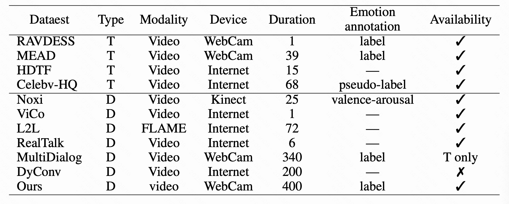

# SocioEmoDialog: A Multimodal Dyadic Dialogue Dataset with Sociologically-Aligned Emotion Distribution

<div>
  <!-- <a href='LICENSE'></a> -->
  <a href='https://huggingface.co/datasets/SocioEmoDialog/SocioEmoDialog-21.8K'></a>
</div>

---
## Introduction
Official repository of the SocioEmoDialog dataset - A large-scale Chinese audio-visual dialogue dataset featuring 21,800 professionally acted dialogues (470+ hours) with synchronized high-quality video and audio. Includes:
- Actor diversity: 119 actors with varied demographics (age, gender, etc.).
- Emotion annotations: Discrete emotional labels aligned with sociologically grounded distributions.
- Diverse scenarios: Covers real-life interactions with natural conversational flow and emotional expressions.
- Professional recording: Filmed in acoustically treated neutral studios using high-end cameras and microphones.


## Works on SocioEmoDialog
We propose the first high-quality multimodal dialogue dataset aligned with sociologically grounded distributions of emotional expression in everyday human interaction. The data set comprises 21,800 dialogue sessions performed by 119 professional actors, spanning 18 emotional categories and 20 dialogue scenarios, with a total duration of 400 hours.
### 1. Statistics
|SocioEmoDialog | Value |
├──-├──-|
|# actors | 119|
|# emotions | 18|
|# dialogues | 21,880|
|# utterance | 268,404|
|# gender-male | 58|
|# gender-famale | 61|
|avg # utterance/dialogue | 12.27|
|avg age | 26|
|total length (hr) | Over 400|

### 2. Comparison of SocioEmoDialog and pervious datasets
Comparison of different datasets. SocioEmoDialog excels in expression diversity, actor scale, data scale, and recording quality. T and D denote for *talking* and *dyadic*, respectively.
<p align="center">
     
</p>

### 3. Data Field Descriptions
#### Script Data Format
```
{
    <dialogue id>: {
        "topic_label": <topic label>,
        "num_utterances": <number of utterances>,
        "utterances": [ # ordered list of conversation turns
            {
                "utterance_id": <utterance id>,
                "speaker_id": 0 or 1,
                "emotion_label": <emotion label>,
                "text": <utterance text>
            },
            ...
        ]
    },
    ...
}
```
- dialogue_id: A unique identifier for the dialogue instance
- topic_label: A label describing the topic or theme of the dialogue (e.g., "Fashion", "Music")
- num_utterances: The total number of utterances (turns) in the dialogue
- utterances: An ordered list of utterance objects, representing the turns in the dialogue
    - utterance_id: A sequential identifier for the utterance within the dialogue
    - speaker_id: An identifier for the speaker, typically 0 for one participant and 1 for the other
    - emotion_label: The annotated emotion associated with the utterance (e.g., "Joy", "Anger")
    - text: The content of the utterance

#### Video Data Format
Each video is named using the pattern `<date>_md5_<side>.mp4`, where `<date>` indicates the recording date, and `<side>` denotes either `left` or `right`, corresponding to the position of the speaker in the video.

## Getting Started
### 1. Environment
> [!Note]
> Make sure your system has [`git`](https://git-scm.com/), [`conda`](https://anaconda.org/anaconda/conda), and [`FFmpeg`](https://ffmpeg.org/download.html) installed.

```bash
git clone https://github.com/KwaiVGI/SocioEmoDialog.git
cd SocioEmoDialog

# create env using conda
conda create -n socioemodialog python==3.8
conda activate socioemodialog

pip install -r requirements.txt
```
You should install the corresponding torch version. Visit the [PyTorch Official Website](https://pytorch.org/get-started/previous-versions) for installation commands if your CUDA version.

### 2. Download
The easiest way to download our dataset is from HuggingFace:
```bash
# !pip install -U "huggingface_hub[cli]"
huggingface-cli download SocioEmoDialog/SocioEmoDialog-21.8K --local-dir data/videos --exclude "*.git*" "README.md" "docs"
```

### 3. Data process
#### Process video files
The original video is `<video_name.mp4>`, in which the audio track contains a stereo structure: the left channel corresponds to the speech of the actor on the left, and the right channel corresponds to the actor on the right. We process the raw data through the following steps:
1. Channel Separation
We use ffmpeg to extract the left and right audio channels into two separate mono audio files, corresponding to the speech of the left and right actors, respectively.
2. Speaker Diarization
Each mono audio track is independently processed using speaker diarization. We apply speaker embedding clustering to annotate speech segments from different speakers within the same channel.
3. Automatic Speech Recognition (ASR)
The Whisper model is used to transcribe each valid speech segment, producing both the transcribed text and accurate timestamps.
4. Dialogue Clip Generation
Based on the speaker segmentation and temporal alignment, the original video is split into short clips organized by dialogue turns, facilitating downstream multimodal analysis.
5. Result Saving
Each transcribed speech segment, along with its timestamp information, is saved as a structured .json file, named consistently with the original audio file.

**Data Processing Instructions**
To process the data, ensure that the raw video files are located in the following directory:
```bash
data/videos/
```
Then run the processing script:
```bash
cd data_tools
python video_processor.py
```
This will extract and prepare audio segments from the videos for ASR.

**Output Directory Structure**
After processing, you should get the following structure for each video:
```
├── <video_name>/
    ├── video_segments/
        ├── 000000.mp4
        └── ...
    ├── wav_left_segments/
        ├── 000000.wav
        └── ...
    ├── wav_right_segments/
        ├── 000000.wav
        └── ...
    ├── <video_name>_left.wav
    ├── <video_name>_right.wav
    ├── <video_name>_left_mute.wav
    ├── <video_name>_right_mute.wav
    ├── <video_name>_left_speaker_diarization.log
    ├── <video_name>_right_speaker_diarization.log
    ├── <video_name>_left_speaker_diarization_asr.json
    └── <video_name>_right_speaker_diarization_asr.json
```
Description of Each Item：
- <video_name>: The base name of the original video file
- video_segments/: Contains turn-level video clips extracted from the original video
- wav_left_segments/: Contains audio segments from the left channel (left speaker only)
- wav_right_segments/: Contains audio segments from the right channel (right speaker only)
- <video_name>_left.wav / <video_name>_right.wav: The raw audio extracted from the left/right channel
- <video_name>_left_mute.wav / <video_name>_right_mute.wav: The left/right audio with the non-target speaker muted
- <video_name>_left_speaker_diarization.log / ...right...: Log file containing speaker diarization segment info
- <video_name>_left_speaker_diarization_asr.json / ...right...: Transcription results (ASR) for the left/right speaker segments

#### Extract ASR-aligned scripts
Run the following code to retrieve the matching script lines for each actor's utterance.
```bash
python whisper_asr.py
```

## Evaluation
### 1. Emotion
To test the emotion classification functionality, run the following command:
```bash
cd eval_tools
python emotion/emotion_classfication.py
```
**Note**: Replace `penai.api_key = "your-api-key"` in the script with your actual OpenAI API key.

To test the emotion statistics functionality, run the following command:
```bash
python emotion/emotion_evaluator.py
```

### 2. Videos
#### Body Segmentation
First, clone [the official repository](https://github.com/zllrunning/face-parsing.PyTorch) and follow its instructions to set up the environment:
```bash
cd eval_tools/video/BodySegmentationTool
git clone https://github.com/zllrunning/face-parsing.PyTorch.git
```
Then, refer to the official repository to install dependencies and download the pretrained model (79999_iter.pth).
Once face-parsing.PyTorch is set up, run the following command:
```bash
python BodySegmentationTool.py
```

#### Eyes Tracking
First, clone [the official repository](https://github.com/TadasBaltrusaitis/OpenFace) and follow its instructions to set up the environment:
```bash
cd eval_tools/video/EyesTracking
git clone https://github.com/TadasBaltrusaitis/OpenFace.git
```
Once OpenFace is set up, run the eye tracking script:
```bash
python EyesTracking.py
```
To generate a heatmap of head pose data, run the following script:
```bash
python DataToPlot_HeatMap.py
```

## Citation
If you find SocioEmoDialog useful for your research, welcome to star this repo and cite our work using the following BibTeX:
```bibtex
@unpublished{socioemodialog2025,
  title   = {SocioEmoDialog: A Multimodal Dyadic Dialogue Dataset with Sociologically-Aligned Emotion Distribution},
  author  = {Yi Zheng, Yifan Xu, Yan Zhou, Ming chen, Xiaohan Li, Shenze Huang, Yue Zhang, Likun Yu, Pengfei Wan, Di Zhang, Guoying Zhao},
  note    = {Under review at NeurIPS 2025},
  year    = {2025}
}
```